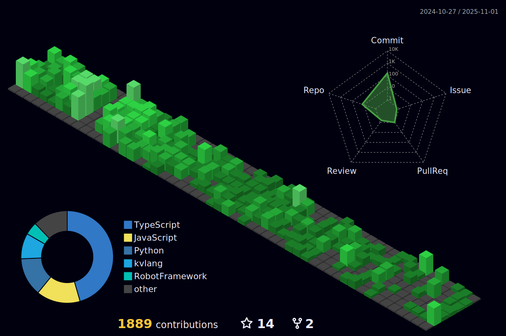

<h1 align="center">Olá eu sou Darlan Martins</h1>

 <!-- 

 

 -->

 <!-- 

 

 -->
 
 

  

 

 

  &nbsp;
 &nbsp;
 

 <!--
 
 

  -->
 &nbsp;
 &nbsp;

## Minhas Habilidades

#### Principais:

#### Estudando no momento:

#### Databases:
&nbsp;

#### Ferramentas:
&nbsp;
&nbsp;
&nbsp;

&nbsp;
&nbsp;

## Contatos:

 

   

&nbsp;&nbsp;
 
 <!--

  

-->
  
  

